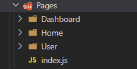
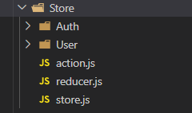

# Optimizing Your React Project Structure: A Guide to Effective Folder Architecture with Hooks and Redux

I have read many articles, watched videos on YouTube, and searched many repositories on GitHub. Still, I haven't found any resources that could explain Optimizing and the best folder architecture to fulfil for every React js Project.

### The folder structure looks like this:

- Assets
- Atoms
- Components
- DefaultLayout
- Hooks
- Pages
- Routes
- Store
- Utils

### Assets:

- As the name says, In this folder we add a global base CSS file and image of the project.

### Atoms:

- The "Atoms" Folder typically contains the smallest built-in reusable component.
- Ex: Button, Input, Alerts, Badges, Breadcrumbs, Heading etc.

### Components:

- The "Components" folder contains multiple Atoms components and makes a block of a page in React.js.
- You can see the folder name and structure above.

### DefaultLayout:

- As the name says, In the folder we will store the default layout file. This file typically contains common UI elements such as headers, footers, and navigation menus.
- You can see the folder name and structure above the image.
  - **Home**: In this folder, the header and footer components are used repeatedly on every page. Therefore, we have created a "Home" component where we can contain the header and footer, as well as default routes.
  - **Dashboard**: Same as the Dashboard header, footer and navigation menu components are used repeatedly on every page. Therefore, we have created a "Dashboard" component where we can contain the header, footer and navigation menu, as well as default routes.

### Hooks:

- The "Hooks" folder in React is primarily utilized for creating reusable logic and custom hooks.
- As you can see we just created two customize hook
  - AuthGuard: Handle Authentication
  - useDarkMode: Handle light and dark mode

### Pages:

- This is the heart of our application.
- As the name suggests, by utilizing the components and atoms folders, we can create a variety of distinct pages that will greatly enhance the functionality of our application.
  - Ex. Home, Dashboard, etc...

### Routes:

This folder contains public and private routes as you can see in the above image.

### Store

- The "store" is a component of Redux. Within this directory, we will create an "action" folder responsible for making API calls, a "reducer" folder for managing state, an "action type" folder for defining action types, and finally a "store" file that combines all the reducers

### Utils

- The "utils" folder refers to commonly used for specific tasks and can be throughout the project.
  - Ex: Date and time formatting, Validation functions, Math functions etc...

**Note**:- In each folder, there is an "index.js" file that exports the files contained within that folder. This export can be utilized to import specific files from that folder for use on any page.

<h1 align="center">Hi 👋, I'm Satish Baghel</h1>
<h3 align="center">A passionate frontend developer from India</h3>

<h3 align="left">Connect with me:</h3>

<h3 align="left">Languages and Tools:</h3>

        

